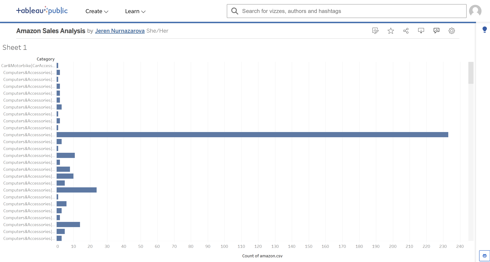

# Amazon Sales Analysis — Power BI & Tableau

*Note: This project uses a public/practice Amazon product dataset for portfolio purposes. It is not affiliated with, sponsored by, or completed on behalf of Amazon.*

**Dataset source:** [Amazon Sales Dataset — Kaggle](https://www.kaggle.com/datasets/karkavelrajaj/amazon-sales-dataset)

## Project Overview
This project focuses on analyzing sales performance and customer sentiment for Amazon products. The goal was to transform raw retail data into actionable business insights, exploring how pricing, category, and customer ratings relate to one another.

## Key Features
- **Dynamic KPIs:** Total revenue tracking (4.58M INR)
- **Interactive Slicers:** Filter data by product categories
- **Sentiment Analysis:** Correlation between pricing and average customer ratings
- **Advanced Data Cleaning:** Processed raw strings into financial numeric types using Power Query
- **SQL Analysis:** Queried and filtered top-rated products using SQL (PostgreSQL) — see `amazon_sales_analysis.sql`

## Tools Used
- Power BI Desktop (DAX, Power Query, Data Modeling)
- Tableau Public (Data Visualization)
- SQL (PostgreSQL)

## Dashboard Preview

## Tableau Preview
This section provides an overview of product category distribution on Amazon.

---
Developed as part of a self-directed Finance & Data Analytics portfolio.
